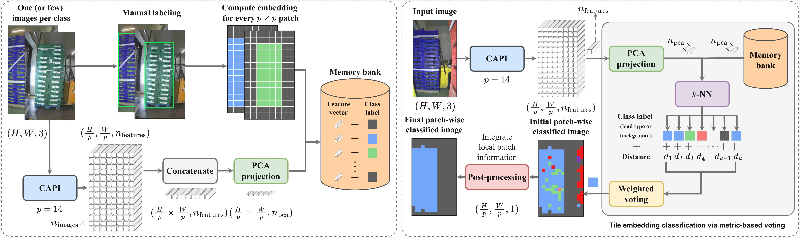

# From Few-Shot to Zero-Shot Pallet Load Recognition: A Deployed Embedding-Based Vision System for Industrial Logistics

[](https://openaccess.thecvf.com/content/WACV2026/papers/del_Olmo_From_Few-Shot_to_Zero-Shot_Pallet_Load_Recognition_A_Deployed_Embedding-Based_WACV_2026_paper.pdf) [](https://huggingface.co/datasets/jjldo21/IndustrialLateralLoads)

---

## Introduction

This project presents a computationally efficient approach for object detection in industrial environments, specifically focusing on lateral loads. We propose **Few-Shot** and **Zero-Shot** solutions that leverage state-of-the-art foundation models (DINOv2, DINOv3, CAPI, and RADIO) to achieve high performance with minimal or no annotated data. Our work addresses the challenges of:
- **Data Scarcity**: Reducing the annotated data requirement nearly to zero.
- **Adaptability**: Quickly adapting to new object classes (e.g., different types of loads).
- **Robustness**: Handling complex industrial backgrounds and occlusions.

---

## Abstract

Automated pallet load recognition is a critical task in industrial logistics, but the deployment of conventional deep learning systems is often unfeasible. Their reliance on large, manually annotated datasets creates a prohibitive bottleneck in terms of cost and time, especially in dynamic environments where product lines frequently change. To overcome this challenge, we introduce a highly flexible, dual-mode vision system built upon dense patch embeddings. Our primary, few-shot approach leverages features from the CAPI vision model to construct a compact memory bank from as little as a single labeled example per class. Classification is then performed via a simple yet highly effective $k$-nearest neighbor search. For annotation-free scenarios, we also propose a zero-shot mode that identifies the load by finding the rectangular region that minimizes intra-class feature variance. We demonstrate state-of-the-art performance on a new, challenging industrial dataset, where our few-shot method attains a $mAP_{50-95}$ over 90\% with only one support image per class. Additionally, the fully unsupervised approach achieves a notable $mAP_{50-95}$ of up to 75\%. The system's robustness and practical value were validated through its successful deployment in high-stakes, real-world scenarios. Our findings establish a basis for lightweight solutions that support the rapid, data-efficient integration of new vision systems into industrial workflows.
<div align="center">
  
  <br> <b>Overview of our few-shot approach for pallet load recognition.</b>
</div>

---

## Dataset

The experiments in this paper were conducted using the *IndustrialLateralLoads* dataset.

- **Hugging Face Dataset**: [jjldo21/IndustrialLateralLoads](https://huggingface.co/datasets/jjldo21/IndustrialLateralLoads)

This dataset contains annotated images of various industrial loads in realistic warehouse settings.

---

## Installation

1.  **Clone the repository:**
    ```bash
    git clone https://github.com/juanjesus-ldo/EmbeddingLoadRecognition.git
    cd EmbeddingLoadRecognition
    ```

2.  **Install dependencies:**
    We recommend using a virtual environment (e.g., conda or venv).
    ```bash
    pip install -r requirements.txt
    ```
---

## Usage

The repository is organized into three main sections: `few_shot`, `zero_shot`, and `baselines`.

### Few-Shot Method

The Few-Shot approach uses a small set of support images (shots) to detect objects in query images.

**Script:** `few_shot/main.py`

**Arguments:**
- `input_folder`: Path to the folder with images to process (organized by class).
- `models_config`: JSON file defining the support images (models) and background images.
- `output_folder`: Path to save results.
- `--num_models`: Number of shots per class (default: 1).
- `--dinov2_model`, `--dinov3_model`, `--capi_model`, `--radio_model`: **(Required)** Select the encoder architecture.
- `--half_precision`: Use half precision (fp16) for the model.

**Example:**
```bash
python3 few_shot/main.py \
    /path/to/dataset \
    /path/to/config.json \
    /path/to/output \
    --num_models 5 \
    --dinov2_model dinov2_vitb14
```

### Zero-Shot Method

The Zero-Shot approach detects objects without any specific training examples for the target class, relying on generic feature extraction and intraclass variance minimization.

**Script:** `zero_shot/main.py`

**Arguments:**
- `-fp`, `--folder_path`: Path to the folder with images to process.
- `--dinov2_model`, `--dinov3_model`, `--capi_model`, `--radio_model`: **(Required)** Select the encoder architecture.
- `--save_txt`: Generate .txt files with detections.
- `--step_by_step`: Run interactively.

**Example:**
```bash
python3 zero_shot/main.py \
    -fp /path/to/images \
    --capi_model capi_vitl14_p205 \
    --save_txt
```

### Baselines

We compare our methods against strong baselines like **Florence-2** and **YOLOE**.

#### Florence-2 (Zero-Shot)
```bash
python3 baselines/florence2/inference.py \
    -if /path/to/images \
    -p "load" \
    --save_txt
```

#### YOLOE (Visual Prompt)
```bash
python3 baselines/yoloe/inference_visual.py \
    -if /path/to/images \
    -si /path/to/source_image.jpg \
    --bbox x1 y1 x2 y2 \
    --save_txt
```

#### YOLOE (Text Prompt)
```bash
python3 baselines/yoloe/inference_text.py \
    -if /path/to/images \
    -tp "load" \
    --save_txt
```

---

## Evaluation

To evaluate the performance of the detection models, we use the **Mean Average Precision (mAP)** metric.

We utilize the [Cartucho/mAP](https://github.com/Cartucho/mAP) repository for computing these metrics.

**Steps:**
1.  Generate detection results using any of the methods above (ensure `--save_txt` is used).
2.  Clone the mAP repository:
    ```bash
    git clone https://github.com/Cartucho/mAP.git
    ```
3.  Copy your ground truth files into `mAP/input/ground-truth/`.
4.  Copy your generated detection files into `mAP/input/detection-results/`.
5.  Run the evaluation script:
    ```bash
    python mAP/main.py
    ```
    
---

## Citation

If you find this work useful, please cite our paper:

```bibtex
@InProceedings{del_Olmo_2026_WACV,
    author    = {del Olmo, Juan Jes\'us Losada and Ballesteros, Emilio Pardo and L\'opez-de-Teruel, Pedro E. and Ruiz, Alberto},
    title     = {From Few-Shot to Zero-Shot Pallet Load Recognition: A Deployed Embedding-Based Vision System for Industrial Logistics},
    booktitle = {Proceedings of the IEEE/CVF Winter Conference on Applications of Computer Vision (WACV)},
    month     = {March},
    year      = {2026},
    pages     = {2901-2911}
}
```

---

## License

This project is licensed under the MIT License - see the [LICENSE](LICENSE) file for details.

---

## Contact
If you have questions or suggestions, you can contact me at `juanjesus.losada@um.es`.
